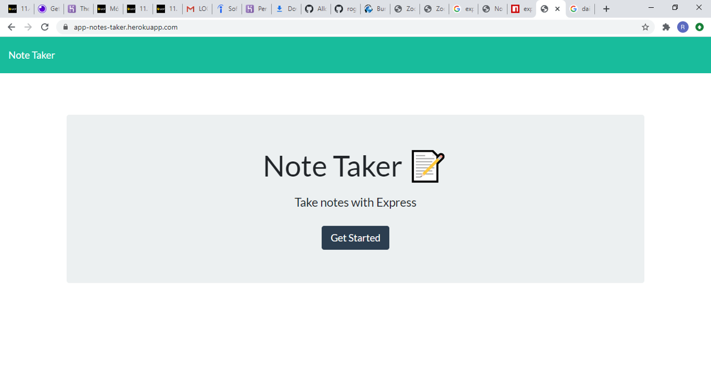
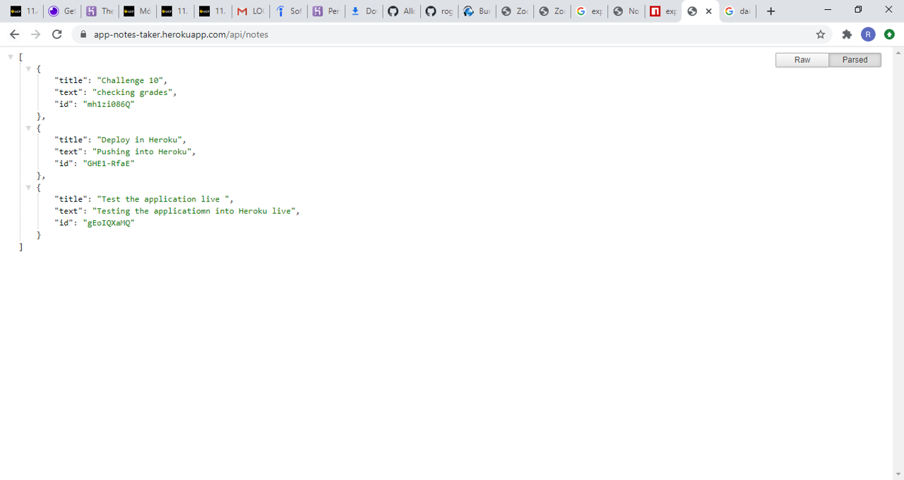

# Note Taker with Express.js

## Description 

A Great application that can be used to write and save notes for daily life.

It works with Express.js, you can add, see and delete all notes you want to plan and schedule your daily life.

Application developed using ES6 Syntax and Express.js. 

## Table of Contents

* [URLs](#urls)
* [Installation](#installation)
* [Usage](#usage)
* [Contributing](#Contributing)
* [License](#license)
* [Test](#Test)
* [Questions](#questions)
* [Screenshots](#screenshots)

## URLs

* Deployed Application: 
    - [https://rogers0404.github.io/11-note-taker/](https://rogers0404.github.io/11-note-taker/)  Static
    - [https://app-notes-taker.herokuapp.com/](https://app-notes-taker.herokuapp.com/)            Live

* GitHub Repository:
    - [HTTPS: https://github.com/rogers0404/11-note-taker.git](https://github.com/rogers0404/11-note-taker.git)    
    - [GIT: git@github.com:rogers0404/11-note-taker.git](git@github.com:rogers0404/11-note-taker.git)

## Installation

You need some packages to run this application, 

- `git clone git@github.com:rogers0404/11-note-taker.git        //clone the repository`
- `npm i                                   // or npm install to get all packages and dependencies of NPM`
- `npm init                                // to get package.json`
- `npm install express                     // check wether you have installed npm packages or just install express`
- `npm install -g heroku                   // install git heroku for deployment and get the server functionality`
- `heroku create app-notes-taker           // name of the app in heroku`
- `npm install shortid                     // install shortid from npm package for generating unique ID`

## Usage 

Defining Express in the application:

`const express = require('express');`

The starting command-line is:

`npm start                                 // to run the server`

Examples of routes:

`router.get('/', (req, res) => {`
`  res.sendFile(path.join(__dirname, '../public/index.html'));`
`});`

`// API GET`
`router.get("/api/notes", (req, res) => {`
`    res.json(notes);`
`  });`

## Contributing

* Rogers Ramirez, Github User: [rogers0404](http://github.com/rogers0404)

## License

Note Taker with Express.js is licensed under the

None

Express.js and shortid Dependency is licensed under the

MIT

## Test

None

## Questions

If you have any questions about the application, you can check the documentation on my GitHub profile [https://github.com/rogers0404](https://github.com/rogers0404).

for more information you can have a question via email [rogers.ramirez2008@gmail.com](rogers.ramirez2008@gmail.com)  .

## Screenshots

### Screenshot 1

### Screenshot 2

### Screenshot 3

### Screenshot 4

### Screenshot 5

